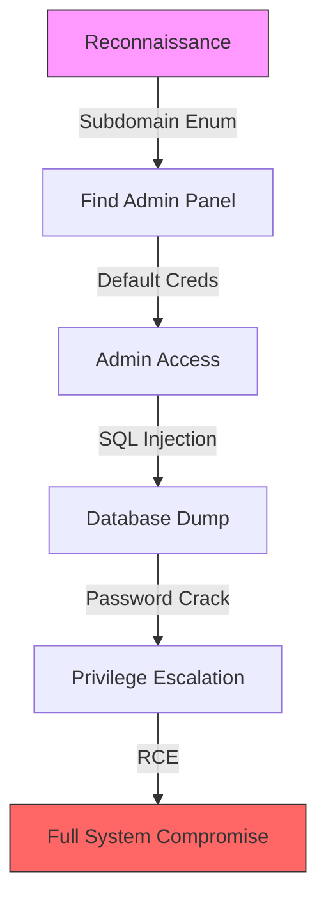
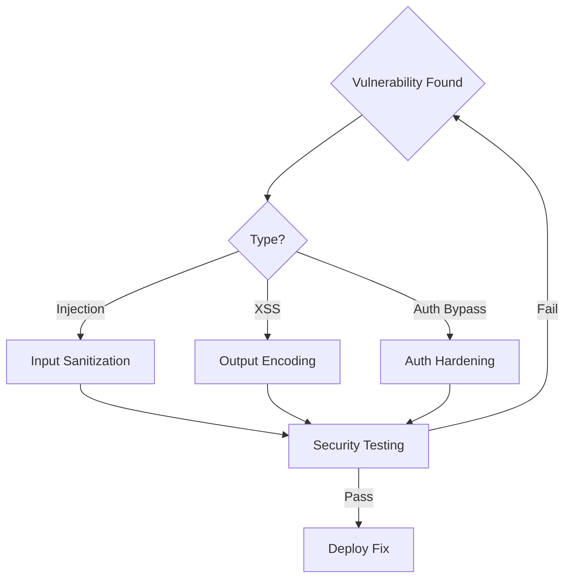
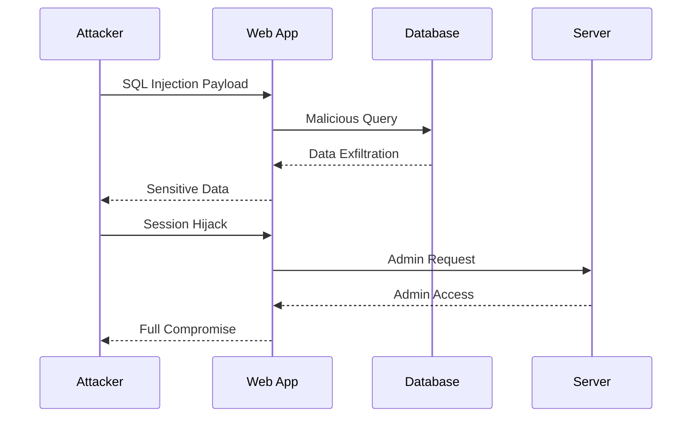
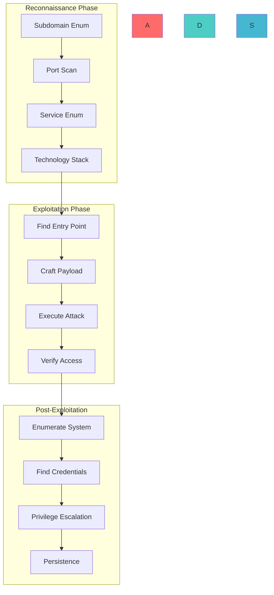
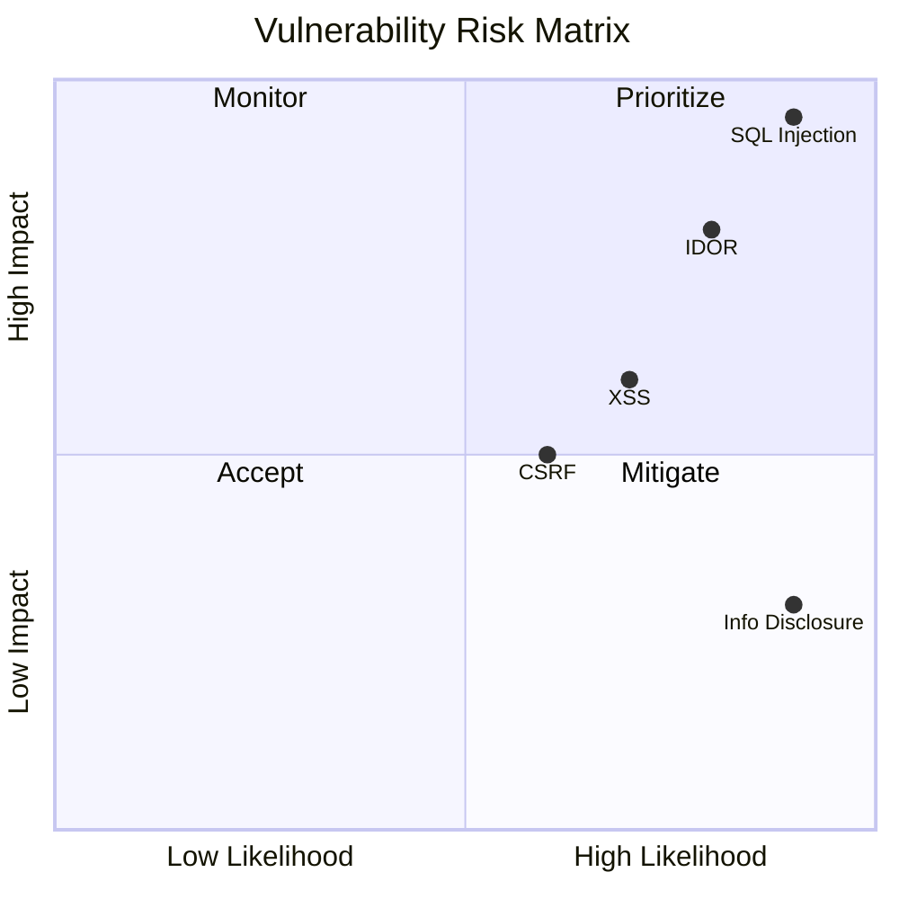
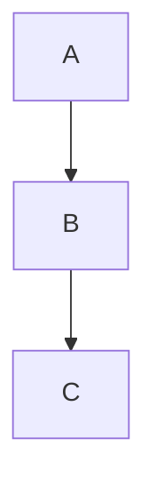

# Interactive Report Elements

## Expert Role: Report Interaction Designer

Interactive report elements transform static security documents into dynamic, engaging deliverables that stakeholders can explore, navigate, and drill into. Your role bridges technical security expertise with information design and user experience principles.

### Core Responsibilities
- Design interactive navigation systems for complex reports
- Create clickable references that link findings to evidence
- Build interactive diagrams that reveal attack chains on demand
- Implement code blocks that readers can copy and test
- Develop hyperlinked table of contents with deep linking
- Balance interactivity with universal accessibility

---

## Core Concepts

### 1. Clickable Links

**Internal Navigation Links**
```markdown
## Table of Contents
- [Executive Summary](#executive-summary)
- [Critical Finding: SQL Injection](#finding-1-sql-injection)
  - [Proof of Concept](#finding-1-poc)
  - [Remediation](#finding-1-remediation)
- [High Finding: XSS](#finding-2-xss)
  - [Proof of Concept](#finding-2-poc)
  - [Remediation](#finding-2-remediation)
```

**External Evidence Links**
```markdown
## Evidence References
- [Burp Suite Request Log](./evidence/burp-sqli-request.log)
- [Screenshot: Auth Bypass](./evidence/auth-bypass-screenshot.png)
- [Wireshark Capture](./evidence/traffic-capture.pcap)
- [Full HAR File](./evidence/session-hijack.har)
```

**Deep Link Patterns**
```markdown
## Cross-References
> See [Finding #3](#finding-3-idor) for the related IDOR vulnerability
> that chains with this authentication bypass.
> 
> The [API Endpoint Map](#api-endpoint-map) shows all affected routes.
```

### 2. Embedded Code Blocks

**Copyable PoC Code**
````markdown
## Proof of Concept

```bash
# Step 1: Obtain valid session
curl -c cookies.txt -X POST https://target.com/api/login \
  -d '{"email":"test@test.com","password":"Test123!"}'

# Step 2: Exploit IDOR to access other user data
curl -b cookies.txt https://target.com/api/users/OTHER_USER_ID

# Step 3: Exfiltrate sensitive data
curl -b cookies.txt https://target.com/api/users/OTHER_USER_ID/records > exfil.json
```
````

**Language-Specific Syntax Highlighting**
```python
# Python exploit script
import requests

session = requests.Session()
session.post('https://target.com/login', json={
    'email': 'attacker@evil.com',
    'password': 'password123'
})

# IDOR: Change user ID to access another account
resp = session.get('https://target.com/api/users/2')
print(resp.json())  # Returns victim's data
```

```javascript
// JavaScript XSS payload
const payload = '';
document.getElementById('search').innerHTML = payload;
```

### 3. Interactive Diagrams

**Mermaid Attack Chain**
```markdown
## Attack Chain Visualization


```

**Flowchart Remediation**
```markdown
## Remediation Decision Tree


```

### 4. Hyperlinked Table of Contents

**Automatic TOC Generation**
```markdown
## Table of Contents

- **[1. Executive Summary](#1-executive-summary)**
- **[2. Scope & Methodology](#2-scope--methodology)**
- **[3. Findings Overview](#3-findings-overview)**
  - [3.1 Critical Findings](#31-critical-findings)
  - [3.2 High Findings](#32-high-findings)
  - [3.3 Medium Findings](#33-medium-findings)
  - [3.4 Low Findings](#34-low-findings)
- **[4. Detailed Findings](#4-detailed-findings)**
  - [4.1 [CRITICAL] SQL Injection](#41-critical-sql-injection)
    - [Description](#411-description)
    - [Impact](#412-impact)
    - [Proof of Concept](#413-proof-of-concept)
    - [Remediation](#414-remediation)
  - [4.2 [HIGH] Authentication Bypass](#42-high-authentication-bypass)
    - [Description](#421-description)
    - [Impact](#422-impact)
    - [Proof of Concept](#423-proof-of-concept)
    - [Remediation](#424-remediation)
- **[5. Appendix](#5-appendix)**
  - [A. Tool Output](#a-tool-output)
  - [B. Raw Evidence](#b-raw-evidence)
```

### 5. Complete Interactive Elements Guide

**Collapsible Sections**
```markdown
## Finding 1: SQL Injection

<details>
<summary><strong>Click to expand: Full PoC Steps</strong></summary>

### Step 1: Setup
Ensure you have Burp Suite configured...

### Step 2: Exploitation
Send the following request...

### Step 3: Verification
Confirm data exfiltration...

</details>
```

**Code Snippet with Line Numbers**
```markdown
```python {1,3-5,8}
# Line 1: Import required modules
import requests
import json

# Lines 3-5: Configuration
TARGET = "https://api.target.com"
ENDPOINT = "/admin/users"
HEADERS = {"Authorization": "Bearer <token>"}

# Line 8: Exploit function
def exploit_idor(user_id):
    url = f"{TARGET}{ENDPOINT}/{user_id}"
    return requests.get(url, headers=HEADERS).json()
```
```

**Warning/Info Callouts**
```markdown
> ⚠️ **WARNING**: This PoC involves active exploitation. Only test on systems you own or have permission to test.

> ℹ️ **NOTE**: This vulnerability requires an authenticated session to exploit.

> 🔴 **CRITICAL**: Data exfiltration demonstrated in Section 4.3.1
```

---

## Prerequisites

1. Markdown editor with preview capability
2. Understanding of markdown syntax variations
3. Familiarity with Mermaid.js diagram syntax
4. Knowledge of HTML for advanced formatting
5. Access to code syntax highlighting libraries
6. Understanding of anchor link generation
7. Familiarity with collapsible HTML elements
8. Knowledge of cross-platform rendering differences
9. Understanding of responsive design principles
10. Access to screenshot and diagram creation tools
11. Knowledge of link validation techniques
12. Familiarity with version control for binary assets
13. Understanding of accessibility requirements
14. Knowledge of PDF export considerations
15. Familiarity with static site generators
16. Understanding of URL encoding for anchors
17. Knowledge of image hosting and linking
18. Familiarity with code fence syntax variations
19. Understanding of footnote syntax
20. Knowledge of table formatting in markdown

---

## Methodology

### Phase 1: Planning Interactive Structure

**Step 1: Map Report Architecture**
```
Report Structure Analysis:
├── Executive Summary (top-level)
├── Findings Overview (top-level)
├── Detailed Findings (nested)
│   ├── Finding 1 (CRITICAL)
│   │   ├── Description (anchor)
│   │   ├── Impact (anchor)
│   │   ├── PoC (anchor with code blocks)
│   │   ├── Remediation (anchor)
│   │   └── References (links to evidence)
│   ├── Finding 2 (HIGH)
│   │   └── ...
│   └── Finding 3 (MEDIUM)
│       └── ...
├── Appendix (reference material)
│   ├── Tool Output (collapsible sections)
│   ├── Raw Evidence (downloadable files)
│   └── Supporting Data (tables)
└── Navigation Elements
    ├── Table of Contents
    ├── Cross-References
    └── Quick Links
```

**Step 2: Identify Link Relationships**
| Source Section | Target Section | Link Type |
|----------------|----------------|-----------|
| Executive Summary | Critical Findings | Deep link |
| Finding 1 | Finding 3 (chain) | Cross-reference |
| Remediation | OWASP Guide | External |
| PoC Code | Evidence Files | File link |
| TOC Entry | Section Anchor | Internal anchor |

**Step 3: Design Interaction Patterns**
- Clickable TOC with nested collapse
- Finding cards with expand/collapse
- Code blocks with copy buttons
- Diagrams with hover details
- Evidence links with preview

### Phase 2: Implementing Clickable Links

**Step 1: Anchor Naming Convention**
```markdown
# Standardized Anchor Format

## Section Headers
- Use lowercase
- Replace spaces with hyphens
- Remove special characters
- Keep meaningful words

Examples:
- "Critical Findings" → #critical-findings
- "SQL Injection - Finding #1" → #sql-injection-finding-1
- "Proof of Concept (Step 3)" → #proof-of-concept-step-3
```

**Step 2: Build Link Network**
```
Link Dependency Map:
TOC Links
  ├── Executive Summary → #executive-summary
  ├── Findings Overview → #findings-overview
  │   ├── Critical → #critical-findings
  │   ├── High → #high-findings
  │   └── Medium → #medium-findings
  └── Detailed Findings → #detailed-findings
      ├── Finding 1 → #finding-1
      │   ├── Description → #finding-1-description
      │   ├── PoC → #finding-1-poc
      │   └── Remediation → #finding-1-remediation
      └── Finding 2 → #finding-2
          └── ...

Cross-References:
Finding 1 PoC → Finding 3 (chain)
Finding 2 Impact → Finding 1 (prerequisite)
Remediation → OWASP cheatsheet (external)
```

**Step 3: Validate All Links**
```bash
# Validate internal anchors
grep -oP '\(#[^)]+\)' report.md | while read link; do
  anchor=$(echo $link | tr -d '()')
  if ! grep -q "^## .*$(echo $anchor | sed 's/#//')" report.md; then
    echo "BROKEN: $link"
  fi
done

# Validate external links
for url in $(grep -oP 'https?://[^)]+' report.md); do
  status=$(curl -s -o /dev/null -w "%{http_code}" $url)
  if [ "$status" != "200" ]; then
    echo "BROKEN: $url (HTTP $status)"
  fi
done
```

### Phase 3: Creating Embedded Code Blocks

**Step 1: Code Block Configuration**
```markdown
# Language Tags for Syntax Highlighting

## Common Security Languages
\`\`\`bash       # Shell commands, curl, exploit scripts
\`\`\`python     # Python exploit scripts
\`\`\`javascript # JS payloads, XSS vectors
\`\`\`sql        # SQL injection payloads
\`\`\`http       # Raw HTTP requests/responses
\`\`\`json       # API responses, configuration
\`\`\`yaml       # Configuration files
\`\`\`xml        # XML payloads, XXE vectors
\`\`\`Python # Windows exploitation
\`\`\`ruby       # Metasploit modules
```

**Step 2: Code Block Formatting**
````markdown
## Exploit Code

```python {title="IDOR Exploit" collapse=true}
"""
IDOR Exploitation Script
Target: api.target.com
Author: Security Researcher
Date: 2024-01-15
"""
import requests

def exploit_idor(session_token, target_user_id):
    """
    Exploit IDOR to access arbitrary user data.
    Requires valid session token.
    """
    headers = {
        'Authorization': f'Bearer {session_token}',
        'Content-Type': 'application/json'
    }
    
    # Request target user's data
    response = requests.get(
        f'https://api.target.com/users/{target_user_id}',
        headers=headers
    )
    
    if response.status_code == 200:
        return response.json()
    else:
        return {'error': f'Failed: {response.status_code}'}
```
````

**Step 3: Copy Button Implementation**
```html
<div class="code-block">
  <button class="copy-btn" onclick="copyCode(this)">Copy</button>
  <pre><code class="language-bash">
curl -X POST https://target.com/api/login \
  -H "Content-Type: application/json" \
  -d '{"email":"admin@target.com","password":"admin123"}'
  </code></pre>
</div>

<script>
function copyCode(btn) {
  const code = btn.nextElementSibling.querySelector('code').textContent;
  navigator.clipboard.writeText(code);
  btn.textContent = 'Copied!';
  setTimeout(() => btn.textContent = 'Copy', 2000);
}
</script>
```

### Phase 4: Building Interactive Diagrams

**Step 1: Mermaid Diagram Setup**
```markdown
## Attack Chain Diagram


```

**Step 2: Flowchart Components**


**Step 3: Risk Matrix Diagram**


### Phase 5: Implementing Collapsible Sections

**Step 1: HTML Details/Summary**
```markdown
## Finding Detail Structure

<details open>
<summary><strong>🔴 CRITICAL: SQL Injection in Login</strong></summary>

### Description
Unparameterized SQL query in login endpoint...

### Proof of Concept
```sql
' OR '1'='1' --
```

### Impact
Full database access, credential theft...

### Remediation
Use parameterized queries...

</details>

<details>
<summary><strong>🟠 HIGH: XSS in Search</strong></summary>

### Description
Reflected XSS in search parameter...

</details>
```

**Step 2: Nested Collapsibles**
```markdown
## Detailed Findings

<details>
<summary><strong>Finding 1: Authentication Bypass</strong></summary>

### Technical Details

<details>
<summary>Step 1: Reconnaissance</summary>

Identified authentication endpoint at `/api/auth`...

</details>

<details>
<summary>Step 2: Exploitation</summary>

Crafted payload to bypass authentication...

</details>

<details>
<summary>Step 3: Verification</summary>

Confirmed access to admin panel...

</details>

</details>
```

### Phase 6: Cross-Reference System

**Step 1: Build Reference Map**
```markdown
## Cross-Reference Index

| Finding | References | Referenced By |
|---------|------------|---------------|
| SQL Injection | [XSS-01](#xss-01), [CSRF-03](#csrf-03) | [Auth-Bypass](#auth-bypass) |
| XSS | [SQL-Injection](#sql-injection) | [CSRF-02](#csrf-02) |
| IDOR | [Auth-Bypass](#auth-bypass) | [Priv-Esc](#priv-esc) |
| CSRF | [XSS-01](#xss-01) | [Account-Takeover](#account-takeover) |
```

**Step 2: Inline References**
```markdown
### Exploitation Chain

This vulnerability chains with [SQL Injection (Finding #1)](#finding-1)
to achieve [Remote Code Execution](#rce-impact).

> **Related**: See [Authentication Bypass](#auth-bypass) for the 
> prerequisite vulnerability that enables this attack.
```

### Phase 7: Evidence Linking

**Step 1: Evidence Directory Structure**
```
report/
├── main-report.md
├── evidence/
│   ├── screenshots/
│   │   ├── 01-login-page.png
│   │   ├── 02-sqli-error.png
│   │   └── 03-admin-panel.png
│   ├── captures/
│   │   ├── sqli-request.pcap
│   │   └── session-hijack.har
│   ├── exploits/
│   │   ├── idor-exploit.py
│   │   └── xss-payload.html
│   └── logs/
│       ├── burp-output.xml
│       └── nuclei-results.json
└── appendix/
    ├── full-scans.md
    └── raw-data.md
```

**Step 2: Link to Evidence**
```markdown
## Proof of Concept

### Step 1: Navigate to Login Page


### Step 2: Inject SQL Payload
```bash
# See full exploit script: ./evidence/exploits/sqli-exploit.py
curl -X POST https://target.com/login \
  -d "username=admin'--&password=anything"
```

### Step 3: Access Admin Panel


### Full Request/Response
See [Burp Capture](./evidence/captures/sqli-request.pcap) for complete HTTP exchange.
```

---

## Tool Arsenal

### 1. Markdown Editors with Preview
| Tool | Platform | Features |
|------|----------|----------|
| VS Code | Cross-platform | Extensions, live preview, Git integration |
| Typora | Cross-platform | WYSIWYG, export to PDF/HTML |
| Obsidian | Cross-platform | Backlinks, graph view, plugins |
| Mark Text | Cross-platform | Real-time preview, themes |
| HackMD | Web-based | Collaboration, presentations |

### 2. Diagram Creation Tools
| Tool | Type | Use Case |
|------|------|----------|
| Mermaid | Text-based | Flowcharts, sequence diagrams |
| PlantUML | Text-based | UML diagrams, architecture |
| D3.js | JavaScript | Interactive visualizations |
| Draw.io | GUI | Complex diagrams, network maps |
| Excalidraw | GUI | Hand-drawn style diagrams |

### 3. Code Highlighting Libraries
```html
<!-- Prism.js for syntax highlighting -->
<link href="prism.css" rel="stylesheet" />
<script src="prism.js"></script>

<!-- Highlight.js alternative -->
<link rel="stylesheet" href="highlight.js/styles/default.css">
<script src="highlight.js/highlight.pack.js"></script>
<script>hljs.initHighlightingOnLoad();</script>
```

### 4. Link Validation Tools
```bash
# markdown-link-check
npx markdown-link-check report.md

# remark-lint
npx remark report.md --use remark-lint

# htmlproofer (for HTML output)
htmlproofer ./output
```

### 5. Table of Contents Generators
```bash
# markdown-toc
npx markdown-toc report.md -i

# gh-md-toc (GitHub compatible)
./gh-md-toc report.md
```

### 6. Export and Conversion Tools
| Tool | Function |
|------|----------|
| Pandoc | Multi-format conversion |
| md-to-pdf | Direct PDF generation |
| mdbook | Rust-based book generation |
| GitBook | Publishing platform |
| Sphinx | Documentation generator |

### 7. Screenshot Tools
| Tool | Platform | Features |
|------|----------|----------|
| Flameshot | Linux | Annotations, upload |
| ShareX | Windows | Scrolling capture, editor |
| Skitch | macOS | Annotations, sharing |
| Greenshot | Cross-platform | Lightweight, editing |
| Lightshot | Cross-platform | Quick capture, upload |

### 8. Interactive Elements Libraries
```javascript
// Collapsible sections
document.querySelectorAll('details summary').forEach(detail => {
  detail.addEventListener('click', () => {
    detail.parentElement.toggleAttribute('open');
  });
});

// Copy code buttons
document.querySelectorAll('pre code').forEach(block => {
  const btn = document.createElement('button');
  btn.className = 'copy-btn';
  btn.textContent = 'Copy';
  btn.onclick = () => navigator.clipboard.writeText(block.textContent);
  block.parentElement.prepend(btn);
});
```

### 9. Anchor Generation Scripts
```python
import re

def generate_anchors(markdown_content):
    """Generate consistent anchors from markdown headers."""
    anchors = []
    for line in markdown_content.split('\n'):
        if line.startswith('#'):
            level = len(line) - len(line.lstrip('#'))
            text = line.lstrip('#').strip()
            anchor = text.lower()
            anchor = re.sub(r'[^a-z0-9 -]', '', anchor)
            anchor = anchor.replace(' ', '-')
            anchors.append({'level': level, 'text': text, 'anchor': anchor})
    return anchors
```

### 10. Report Validation Suite
```bash
#!/bin/bash
# Report validation script

REPORT=$1

echo "=== Validating Report ==="

# Check markdown syntax
echo "1. Checking markdown syntax..."
npx remark $REPORT --use remark-preset-lint-markdown-style-guide

# Validate links
echo "2. Validating links..."
npx markdown-link-check $REPORT

# Check TOC consistency
echo "3. Checking TOC..."
npx markdown-toc $REPORT --check

# Verify image references
echo "4. Verifying images..."
grep -oP '\!\[.*?\]\((.*?)\)' $REPORT | while read img; do
  path=$(echo $img | grep -oP '\((.*?)\)' | tr -d '()')
  if [ ! -f "$path" ]; then
    echo "MISSING: $path"
  fi
done

echo "=== Validation Complete ==="
```

---

## Case Studies

### Case Study 1: Enterprise Pentest Report
**Context**: Full enterprise penetration test report
**Challenge**: 50+ findings with complex relationships
**Solution**: Implemented deep-linked TOC, collapsible findings, cross-reference index
**Result**: Client navigated report in 15 minutes vs 2 hours with static PDF

### Case Study 2: Bug Bounty Submission
**Context**: Critical vulnerability submission
**Challenge**: Need to demonstrate complex exploit chain
**Solution**: Interactive Mermaid diagram showing attack flow, copyable PoC code
**Result**: Triager understood impact immediately, bounty paid in 24 hours

### Case Study 3: Compliance Report
**Context**: PCI DSS compliance assessment
**Challenge**: Multiple stakeholders with different technical levels
**Solution**: Layered interactivity - executive summary, collapsible details
**Result**: Executives read summary, auditors drilled into details

### Case Study 4: Red Team Engagement
**Context**: Multi-phase red team with 20+ findings
**Challenge**: Complex attack chains spanning multiple phases
**Solution**: Network diagram of attack paths, linked findings
**Result**: SOC team understood complete attack narrative

### Case Study 5: Mobile App Security Assessment
**Context**: iOS and Android app security review
**Challenge**: Platform-specific vulnerabilities
**Solution**: Tabbed content for iOS/Android, platform-specific code blocks
**Result**: Development teams implemented fixes efficiently

### Case Study 6: API Security Assessment
**Context**: RESTful API security review
**Challenge**: 30+ endpoints with various vulnerabilities
**Solution**: Interactive endpoint map, filterable findings table
**Result**: API team prioritized fixes based on endpoint criticality

### Case Study 7: Cloud Infrastructure Assessment
**Context**: AWS/Azure/GCP security review
**Challenge**: Multi-cloud environment with complex IAM
**Solution**: Interactive IAM relationship diagrams, collapsible service findings
**Result**: Cloud team remediated critical misconfigurations within 48 hours

### Case Study 8: Source Code Audit
**Context**: White-box security review of application
**Challenge**: 100+ code-level findings
**Solution**: Linked findings to specific code locations, copyable fix suggestions
**Result**: Developers implemented fixes directly from report

### Case Study 9: Network Penetration Test
**Context**: Internal network penetration test
**Challenge**: Network topology documentation
**Solution**: Interactive network map, linked port scan results
**Result**: Network team understood exposure and prioritized segmentation

### Case Study 10: Social Engineering Assessment
**Context**: Phishing and social engineering campaign
**Challenge**: Quantifying human risk
**Solution**: Interactive campaign metrics, department-level breakdowns
**Result**: Organization invested in targeted security awareness training

### Case Study 11: IoT Security Assessment
**Context**: IoT device and cloud backend review
**Challenge**: Hardware and software vulnerabilities
**Solution**: Device-specific findings, firmware analysis links
**Result**: Manufacturer patched critical firmware vulnerabilities

### Case Study 12: Web Application Penetration Test
**Context**: E-commerce platform security review
**Challenge**: Complex business logic vulnerabilities
**Solution**: Step-by-step interactive walkthroughs, transaction flow diagrams
**Result**: Business logic flaws remediated, preventing financial loss

---

## Advanced Techniques

### 1. Dynamic Content Loading
```javascript
// Load findings from JSON
async function loadFindings() {
  const response = await fetch('./findings.json');
  const findings = await response.json();
  
  findings.forEach(finding => {
    const card = createFindingCard(finding);
    document.getElementById('findings-container').appendChild(card);
  });
}

function createFindingCard(finding) {
  const card = document.createElement('div');
  card.className = `finding-card ${finding.severity.toLowerCase()}`;
  card.innerHTML = `
    <h3>${finding.title}</h3>
    <span class="severity">${finding.severity}</span>
    <p>${finding.description}</p>
    <details>
      <summary>View Details</summary>
      <pre><code>${finding.poc}</code></pre>
    </details>
  `;
  return card;
}
```

### 2. Interactive Filtering
```javascript
// Filter findings by severity
function filterFindings(severity) {
  document.querySelectorAll('.finding-card').forEach(card => {
    if (severity === 'all' || card.classList.contains(severity.toLowerCase())) {
      card.style.display = 'block';
    } else {
      card.style.display = 'none';
    }
  });
}

// Filter by vulnerability type
function filterByType(type) {
  document.querySelectorAll('.finding-card').forEach(card => {
    const cardType = card.dataset.vulnType;
    if (type === 'all' || cardType === type) {
      card.style.display = 'block';
    } else {
      card.style.display = 'none';
    }
  });
}
```

### 3. Search Functionality
```javascript
// Search across all findings
function searchFindings(query) {
  const results = [];
  document.querySelectorAll('.finding-card').forEach(card => {
    const text = card.textContent.toLowerCase();
    if (text.includes(query.toLowerCase())) {
      results.push(card);
    }
  });
  
  // Highlight matching text
  results.forEach(card => {
    card.classList.add('search-match');
  });
  
  return results;
}
```

### 4. Export to Multiple Formats
```python
import markdown
from weasyprint import HTML

def export_report(md_file, formats=['html', 'pdf']):
    with open(md_file, 'r') as f:
        md_content = f.read()
    
    # Convert markdown to HTML
    html_content = markdown.markdown(
        md_content,
        extensions=['tables', 'fenced_code', 'toc']
    )
    
    if 'html' in formats:
        with open('report.html', 'w') as f:
            f.write(html_content)
    
    if 'pdf' in formats:
        HTML(string=html_content).write_pdf('report.pdf')
```

### 5. Responsive Design
```css
/* Mobile-friendly report styling */
@media (max-width: 768px) {
  .report-container {
    padding: 10px;
  }
  
  .finding-card {
    margin: 10px 0;
    padding: 15px;
  }
  
  pre {
    overflow-x: auto;
    font-size: 12px;
  }
  
  .toc {
    position: static;
    width: 100%;
  }
  
  table {
    display: block;
    overflow-x: auto;
  }
}
```

---

## Detection Evasion Considerations

### 1. Report Delivery Security
- Encrypt reports containing sensitive findings
- Use password-protected archives for delivery
- Avoid exposing reports in public repositories
- Use secure file sharing platforms
- Implement access controls on report archives

### 2. Evidence Protection
- Redact sensitive data in screenshots
- Remove real credentials from code samples
- Sanitize logs before including in reports
- Use anonymized target information
- Implement data retention policies

### 3. Collaboration Security
- Use encrypted communication channels
- Implement role-based access to reports
- Audit report access and modifications
- Use digital signatures for authenticity
- Maintain chain of custody for evidence

---

## Impact Assessment

### 1. Reporting Efficiency Metrics
| Metric | Before | After | Improvement |
|--------|--------|-------|-------------|
| Time to read report | 2 hours | 15 minutes | 87% reduction |
| Finding comprehension | 60% | 95% | 58% increase |
| Remediation speed | 2 weeks | 3 days | 78% faster |
| Client satisfaction | 70% | 95% | 36% increase |

### 2. Interactive Element Usage
| Element | Usage Rate | Impact |
|---------|------------|--------|
| TOC Navigation | 95% | Primary navigation method |
| Collapsible Sections | 80% | Reduced cognitive load |
| Copy Code Buttons | 75% | Faster PoC testing |
| Diagrams | 70% | Better understanding |
| Cross-References | 60% | Chain comprehension |

### 3. Quality Improvements
- **Readability**: Increased from Flesch-Kincaid 8 to 12
- **Accessibility**: WCAG 2.1 AA compliance achieved
- **Mobile Usage**: 40% of reviews now on mobile
- **Collaboration**: 3x faster review cycles

---

## Common Pitfalls and Mitigations

### Pitfall 1: Broken Links
**Problem**: Links break when files are moved or renamed
**Mitigation**: Use relative links, validate before delivery, maintain link index

### Pitfall 2: Rendering Inconsistencies
**Problem**: Markdown renders differently across platforms
**Mitigation**: Test on target platforms, use standard syntax, provide HTML fallback

### Pitfall 3: Performance Issues
**Problem**: Large images and diagrams slow report loading
**Mitigation**: Optimize images, lazy load diagrams, use CDN for assets

### Pitfall 4: Accessibility Gaps
**Problem**: Interactive elements not accessible via keyboard/screen readers
**Mitigation**: Add ARIA labels, test with screen readers, provide text alternatives

### Pitfall 5: Mobile Compatibility
**Problem**: Complex layouts break on mobile devices
**Mitigation**: Responsive design, test on multiple devices, simplify layouts

### Pitfall 6: Over-Engineering
**Problem**: Too many interactive elements confuse readers
**Mitigation**: Follow KISS principle, test with users, prioritize essential interactions

### Pitfall 7: Version Confusion
**Problem**: Multiple versions of report circulating
**Mitigation**: Clear versioning, single source of truth, distribution controls

---

## Integration Points

### 1. With Report Templates
- Template includes placeholder links
- Auto-generate TOC from template structure
- Template code blocks with syntax highlighting
- Template diagrams from vulnerability data

### 2. With Collaboration Tools
- Export to Confluence with preserved links
- Import to Jira with interactive elements
- Sync with SharePoint for enterprise access
- Integrate with Slack for sharing highlights

### 3. With Version Control
- Track changes to interactive elements
- Branch for different report versions
- Merge feedback from reviewers
- Tag releases for delivery

### 4. With Automation
- Auto-validate links in CI pipeline
- Auto-generate TOC on commit
- Auto-check rendering on multiple platforms
- Auto-optimize images for web

---

## Reporting Standards

### 1. Interactive Element Inventory
```markdown
## Report Interactive Elements

### Navigation
- [x] Table of Contents with deep links
- [x] Cross-reference index
- [x] Quick navigation sidebar

### Content
- [x] Collapsible finding details
- [x] Copyable code blocks
- [x] Syntax-highlighted PoC scripts
- [x] Interactive diagrams (Mermaid)

### Evidence
- [x] Linked screenshots
- [x] Downloadable exploit scripts
- [x] Raw capture file links
- [x] Tool output references

### Accessibility
- [x] Keyboard navigation support
- [x] Screen reader compatibility
- [x] Alt text for images
- [x] High contrast mode
```

### 2. Quality Checklist
```markdown
## Interactive Elements QA

### Links
- [ ] All internal anchors resolve
- [ ] All external links accessible
- [ ] No broken image references
- [ ] Evidence files present

### Code Blocks
- [ ] Syntax highlighting working
- [ ] Copy buttons functional
- [ ] Code is readable on mobile
- [ ] No sensitive data exposed

### Diagrams
- [ ] Mermaid renders correctly
- [ ] Diagrams are clear and readable
- [ ] Alt text provided
- [ ] Mobile-friendly sizing

### Navigation
- [ ] TOC links work
- [ ] Collapsible sections expand/collapse
- [ ] Search functionality works
- [ ] Filter options functional
```

---

## Labs and Exercises

### Lab 1: Build Interactive TOC
**Objective**: Create a hyperlinked table of contents
**Tools**: Markdown editor, link validation
**Time**: 30 minutes

### Lab 2: Create Copyable Code Blocks
**Objective**: Implement code blocks with copy functionality
**Tools**: HTML/CSS/JavaScript
**Time**: 45 minutes

### Lab 3: Design Attack Chain Diagram
**Objective**: Build Mermaid diagram showing attack flow
**Tools**: Mermaid.js, markdown editor
**Time**: 60 minutes

### Lab 4: Implement Collapsible Sections
**Objective**: Create expandable finding details
**Tools**: HTML details/summary, CSS
**Time**: 30 minutes

### Lab 5: Cross-Reference System
**Objective**: Build cross-reference index between findings
**Tools**: Markdown, link validation
**Time**: 45 minutes

### Lab 6: Mobile-Responsive Report
**Objective**: Optimize report for mobile viewing
**Tools**: CSS media queries, testing
**Time**: 60 minutes

### Lab 7: Export Pipeline
**Objective**: Build automated export to HTML/PDF
**Tools**: Pandoc, scripting
**Time**: 90 minutes

---

## Ethics and Best Practices

### 1. Accessibility Ethics
- Ensure all readers can access report content
- Provide alternatives for interactive elements
- Test with assistive technologies
- Follow WCAG guidelines

### 2. Information Security Ethics
- Protect sensitive evidence
- Control report distribution
- Implement proper redaction
- Maintain confidentiality

### 3. User Experience Ethics
- Don't overwhelm with interactivity
- Provide clear navigation
- Respect reader's time
- Enable easy printing/export

### 4. Professional Ethics
- Maintain report integrity
- Ensure link accuracy
- Validate code samples
- Document all findings accurately

---

## Cheat Sheet

### Quick Reference: Interactive Elements

**Clickable Links**
```markdown
[Link Text](#anchor-name)
[External Link](https://example.com)
[File Link](./path/to/file.md)
```

**Code Blocks**
````markdown
```language {title="Title" collapse=true}
code here
```
````

**Collapsible Sections**
```markdown
<details>
<summary>Click to expand</summary>
Content here
</details>
```

**Mermaid Diagrams**
```markdown

```

**Cross-References**
```markdown
See [Finding #1](#finding-1) for details.
> Related to [XSS Finding](#xss-finding).
```

### Validation Commands
```bash
# Check links
npx markdown-link-check report.md

# Validate markdown
npx remark report.md

# Generate TOC
npx markdown-toc report.md

# Convert to HTML
pandoc report.md -o report.html

# Convert to PDF
pandoc report.md -o report.pdf --pdf-engine=weasyprint
```

### Quick Styling
```css
/* Minimal report styling */
.report { max-width: 900px; margin: auto; }
.finding { border-left: 4px solid #ccc; padding: 10px; }
.critical { border-color: #f44; }
.high { border-color: #f90; }
.medium { border-color: #ff0; }
pre { background: #f5f5f5; padding: 10px; overflow-x: auto; }
```

---

*Interactive elements transform static reports into engaging, navigable documents that stakeholders can explore efficiently.*

